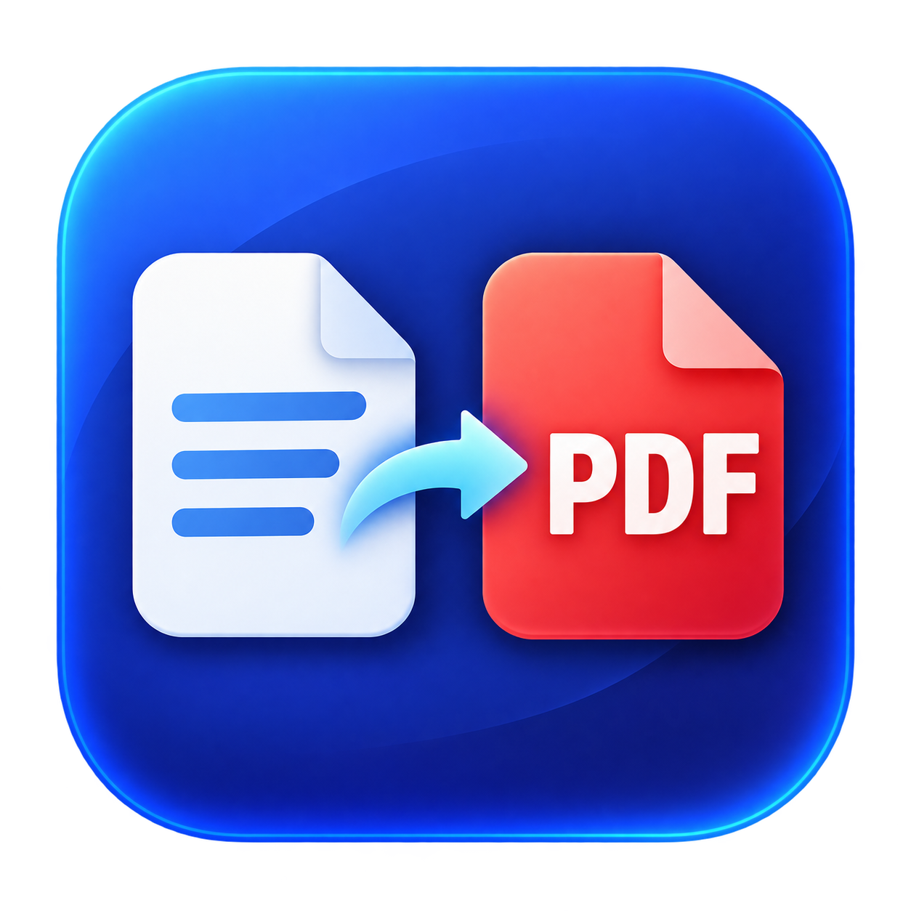

# TopDF — 오프라인 PDF 변환

macOS·Windows·Android에서 문서를 기기 안에서 PDF로 변환합니다. Word·Excel·PowerPoint·HWP/HWPX 엔진을 포함하며 외부 변환 API, 계정, API 키가 필요하지 않습니다. 미리보기에서 페이지 범위와 용지 방향을 정한 뒤 PDF를 저장합니다. macOS Finder 우클릭 메뉴와 Windows 탐색기 우클릭 메뉴, Android 파일 앱의 공유 메뉴를 지원합니다.



[다운로드](https://github.com/kanghyunmin-bot/topdf/releases/tag/v1.0.0-rc.4) · [버그 제보 / 문의](https://github.com/kanghyunmin-bot/topdf/issues) · [MIT 라이선스](LICENSE)

## 현재 상태

1.0.0-rc.4는 경량화·글꼴 정책 통일 사전 릴리스입니다. 모든 지원 변환은 오프라인에서 실행됩니다. 복잡한 수식·차트·레이아웃과 글꼴 차이는 검토가 필요하며, 임의의 모든 파일 형식과 완전한 원본 재현을 보장하지 않습니다.

| 플랫폼 | 설치 파일 | 확인한 범위 |
| --- | --- | --- |
| Apple Silicon Mac, macOS 13+ | ARM64 DMG | 개발 Mac 변환·저장 26개 검사, 이전 RC의 Finder·저장·인쇄창 UI 검사 |
| Intel Mac, macOS 13+ | Intel DMG | Intel macOS 15 CI에서 변환·저장 26개 검사 |
| Windows x64, Windows 10 2004+/11 | ZIP 압축 해제 후 TopDF.exe | Windows x64 CI에서 외부 통신 차단 후 Office·한글 변환, 한글 내용·페이지·범위·방향·텍스트 검사 |
| Android 8+, ARM64/x86_64 | APK | RC4 두 ABI 네이티브 빌드·Java 글꼴 정책 단위 검사·APK 서명/16KB 정렬/인터넷 권한 부재 검사. RC2에는 에뮬레이터 변환 13개 검사 기록이 있으나 RC4의 실제 기기 검증을 대신하지 않음 |

macOS Developer ID 서명·Apple 공증, Windows 배포자 인증서, 독립된 실제 기기와 최소 지원 OS의 설치·인쇄 검증은 남아 있습니다. Android x86_64 엔진은 컴파일 검증을 했으며 실제 실행 검증은 ARM64를 대상으로 했습니다. Android APK는 유지 가능한 사전 릴리스 키로 서명했습니다. 정식 앱 스토어 배포 버전이 아닙니다.

Android 사용법·엔진·소스 빌드는 [Android 안내](platforms/android/README.md)를 확인하세요. Windows 앱의 `우클릭 메뉴 추가` 버튼은 현재 사용자에게 메뉴를 등록하며, Windows 11에서는 `더 많은 옵션 표시` 안에 보일 수 있습니다. 앱 폴더를 옮겼다면 다시 등록합니다.

## 용량과 글꼴 정책

RC4 검증 결과와 파일 해시는 [플랫폼별 최종 검사](docs/rc4-verification.json)에 있습니다. 아래 MB는 1,000,000바이트 기준입니다.

| 플랫폼 | 확인한 설치 파일 공간 |
| --- | --- |
| macOS Apple Silicon | 476.9MB |
| macOS Intel | 493.1MB |
| Windows x64 | NTFS 압축 후 306.5MB; 압축 해제 직후 논리적 파일 합계 829.0MB |
| Android ARM64 / x86_64 | APK·추출 라이브러리·복사 자산 합계 404.8MB / 415.3MB; 실제 기기 DEX·파일시스템 오버헤드 제외 |


macOS 앱은 실제 할당 공간과 파일 크기 합계를 모두 500,000,000바이트 이하로 검사합니다. Windows x64는 변환 필터와 런타임을 유지하고 NTFS 투명 LZX 압축 후 실제 파일 저장 공간을 500,000,000바이트 이하로 검사합니다. Windows의 논리적 파일 크기 합계는 더 크며, NTFS의 쓰기 가능한 사용자 폴더에서 처음 실행하면 같은 압축을 적용합니다. 압축 해제와 첫 실행 전에는 약 829MB의 임시 설치 공간이 필요합니다. Windows 수치는 NTFS 할당 단위로 올림한 파일 공간이며 파일시스템 메타데이터는 제외합니다. FAT/exFAT 설치는 지원하지 않습니다. Android는 APK와 해당 ABI 라이브러리, 첫 실행 시 복사하는 엔진·글꼴 자산의 합계를 검사합니다. 기기별 파일시스템·DEX 캐시·문서 작업 공간은 별도이며 실제 기기의 전체 설치 공간은 미측정입니다.

모든 플랫폼에서 사용 가능한 원래 글꼴은 유지하고, 현대 Office/ODF의 없는 명시적 글꼴 이름은 나눔고딕으로 대체합니다. HWP/HWPX도 정확한 이름 일치 다음에 나눔고딕을 사용합니다. 일반/굵은 글꼴을 포함하며 원본 문서를 바꾸지 않습니다. 구형 Office·특수 기호는 엔진 정책이 남아 있고, 글꼴 변경으로 줄바꿈과 페이지 수가 달라질 수 있습니다. iOS와 Windows ARM64·32비트 Android는 이번 배포의 지원 대상이 아닙니다.

## 다운로드와 설치

[Releases](https://github.com/kanghyunmin-bot/topdf/releases/tag/v1.0.0-rc.4)에서 `TopDF-1.0.0-rc.4-macos-arm64-MAX500MB-UNSIGNED.dmg`를 다운로드합니다. **이 버전은 Developer ID 서명·Apple 공증 전 사전 릴리스입니다. macOS가 실행을 차단할 수 있으며, 설치·실행이 검증된 정식 버전은 아닙니다.**

1. DMG를 열어 `PDF로 변환.app`을 응용 프로그램 폴더로 복사합니다.
2. 앱을 한 번 실행해 Finder 메뉴를 등록합니다.
3. Finder에서 문서를 우클릭하고 `PDF화…`를 선택합니다. `서비스` 하위 메뉴에 보일 수도 있습니다.
4. 미리보기에서 페이지 범위와 A4 세로·가로 또는 원본 방향을 고릅니다.
5. `PDF 저장`을 누르면 원본 옆에 저장됩니다. 같은 이름이 있으면 번호를 붙입니다. `원본 파일 옆에 저장`을 해제하면 저장 위치를 지정할 수 있습니다.

| 릴리스 파일 | 용도 |
| --- | --- |
| `TopDF-1.0.0-rc.4-macos-arm64-MAX500MB-UNSIGNED.dmg` | Apple Silicon 앱 설치용, 서명·공증 전 RC |
| Intel DMG / Windows ZIP / Android APK | 각 플랫폼 사전 릴리스 설치 파일 |
| `TopDF-1.0.0-rc.4-sources.zip` | 데스크톱 엔진·의존성 원본과 RC4 수정 소스·라이선스 |
| `TopDF-1.0.0-rc.4-android-sources.zip` | Android JNI·앱·의존성 소스; 원본 LibreOffice Android 소스 링크는 릴리스 설명 참조 |
| `*-SHA256.txt` | 각 플랫폼 설치 파일의 무결성 확인 |
| `rc4-verification.json` | RC4 플랫폼별 검사 결과와 검증 범위 |
| GitHub 자동 생성 `Source code` | TopDF 자체 소스, 내장 엔진 소스 번들과 별개 |

삭제하려면 앱을 종료하고 앱과 `~/Library/Services/PDF화.workflow`를 휴지통으로 이동합니다. 저장된 PDF는 유지됩니다.

## 로컬 500MB 이하 빌드 (1.0.0-rc.4)

RC4 빌드는 LibreOffice의 도움말, 대부분의 아이콘 테마, 갤러리, 템플릿, Java·Python 자동화, 문서 마법사를 제거합니다. 네이티브 변환 필터, 글꼴, 하이픈 규칙, 레이아웃 로케일과 라이선스는 유지합니다. 다운로드 원본은 바꾸지 않습니다. macOS는 철자 사전도 보존하고 편집용 동의어 사전을 제거합니다. Windows는 편집용 철자·동의어 사전과 영어·한국어 이외 UI 번역을 제거합니다. 빌드는 설치된 앱의 파일 크기 합계와 개발 Mac의 실제 할당 용량이 모두 500,000,000바이트 이하여야 통과합니다. 제거 목록과 바이트 수는 앱의 `Contents/Resources/engine-size-report.json`에 기록합니다.

```sh
python3 scripts/prepare-fonts.py
python3 scripts/build-hwp-gothic.py
TOPDF_OUTPUT_DIR=build/min500-arm64 python3 scripts/build-release.py
TOPDF_ARCH=x86_64 TOPDF_OUTPUT_DIR=build/min500-intel python3 scripts/build-release.py
python3 tests/validate_release.py 'build/min500-arm64/PDF로 변환.app'
python3 tests/validate_slim.py 'build/min500-arm64/PDF로 변환.app'
```

사용 가능한 원래 글꼴은 보존하고, 없는 글꼴은 동봉한 나눔고딕으로 대체합니다. DOCX/XLSX/PPTX 및 ODF의 명시적 글꼴 이름은 임시 복사본에서만 바꿉니다. HWP/HWPX는 정확한 이름 일치를 우선하고 그다음 나눔고딕을 사용합니다. 구형 DOC/XLS/PPT/RTF와 특수 기호의 대체는 엔진 정책이 남아 있습니다. 문서에 포함된 글꼴은 대체 대상으로 잡지 않습니다. 글꼴이 달라지면 줄바꿈·페이지 수가 변할 수 있습니다.

렌더링 비교에는 `pdftoppm`, Pillow, pypdf, python-docx, python-pptx, openpyxl이 필요하며, `build/release`의 기존 전체 엔진 앱을 기준으로 사용합니다. RC4는 사전 릴리스로 제공하며, 경량화와 Developer ID 서명·Apple 공증은 별개의 작업입니다.

## 소스 빌드

Apple Silicon Mac, Xcode Command Line Tools의 Swift 컴파일러와 Python 3이 필요합니다. 이 저장소에는 대용량 엔진 바이너리와 다운로드 자료를 포함하지 않습니다.

빌드 전 아래 엔진을 준비해야 합니다.

1. The Document Foundation의 공식 LibreOffice 26.2.6.3 Apple Silicon 배포본을 `Engines/LibreOffice.app`에 그대로 놓습니다. 다운로드 SHA-256은 `legal/LibreOffice-binary.sha256`에서 확인합니다. 다운로드 원본은 보존하세요. 빌드 스크립트가 앱 내부 복사본에서 headless 변환에 쓰지 않는 리소스와 Python·Java 자동화 구성요소를 제거하고 리소스 서명을 다시 생성합니다. 네이티브 바이너리의 로컬·디버그 심볼도 정리하고 서명을 다시 생성합니다. 실행 코드와 공개 함수 목록은 해시 비교로 보존 여부를 검사합니다.
2. Rustup을 준비한 뒤 `python3 scripts/build-hwp-gothic.py`로 고정 버전 hwp-cli 1.3.1에 선택적 고딕 대체 글꼴 선호를 적용해 ARM/Intel 엔진을 빌드합니다. 소스와 의존성 잠금은 유지합니다.
3. `python3 scripts/prepare-fonts.py`로 해시가 고정된 나눔고딕 Regular/Bold를 준비합니다. OFL 고지와 출처는 `legal/THIRD_PARTY.html`에 있습니다.

```sh
python3 scripts/build-release.py
python3 scripts/install-local.py
open "$HOME/Applications/PDF로 변환.app"
```

앱을 한 번 실행하면 `~/Library/Services/PDF화.workflow`를 설치합니다. 로컬 설치 스크립트는 이전 앱을 `build/backups`에 보관하며 실행 중인 앱을 교체하지 않습니다.

## 검증

Python 검증 코드는 Pillow, pypdf, reportlab을 사용합니다. `tests/sample.*`은 기본 한글·영문 및 페이지 검증용 문서입니다.

```sh
python3 tests/validate_release.py
python3 tests/validate_network.py
```

현재 변환·원본 보존·페이지 범위·용지 방향·입력 오류 검사 26개 및 외부 HTTP 차단 검사를 통과했습니다. 실제 UI에서 페이지 선택 저장, 저장 창, macOS 인쇄창, Finder 빠른 동작 실행을 확인했습니다. 별도 Mac 테스트를 대체하지 않습니다.

## 라이선스와 배포

TopDF 자체 코드·스크립트·문서는 [MIT License](LICENSE)로 공개합니다. `legal/`의 제3자 라이선스·고지와 내장 엔진·외부 의존성은 각 권리자의 기존 라이선스를 따릅니다. TopDF의 MIT 허가는 제3자 구성요소를 MIT로 재라이선스하지 않습니다.

내장 엔진과 제3자 구성요소의 라이선스는 `legal/`에 별도로 보존합니다. LibreOffice의 MPL-2.0 및 각 의존성 라이선스 조건을 따라 대응 소스와 고지를 제공해야 합니다. RC4 데스크톱 엔진은 RC1과 동일한 LibreOffice 원본과 의존성, 수정된 HWP 글꼴 정책 소스를 대응 소스 번들에 제공합니다. Android는 별도의 JNI·의존성 소스 ZIP과 원본 LibreOffice Android 소스 아카이브를 함께 제공합니다. `scripts/package-release.py`는 로컬에 준비한 엔진 소스 자료로 별도 소스 ZIP을 만듭니다. 해당 자료는 Git에서 제외하며, 실제 바이너리 배포 시 함께 제공해야 합니다.

운영·유지보수: [kanghyunmin-bot](https://github.com/kanghyunmin-bot). 문의·오류 제보는 [GitHub Issues](https://github.com/kanghyunmin-bot/topdf/issues)에서 받습니다. 파일의 경로·내용은 로컬 변환에 사용하며 외부 변환 API·사용 분석·자체 오류 전송 기능이 없습니다. 자세한 내용은 [개인정보 안내](docs/개인정보%20안내.html)를 확인하세요. 인증서 개인 키, 비밀번호, API 토큰은 저장소에 넣지 않습니다.

## 출시 전 남은 항목

- Developer ID Application 서명과 Apple 공증
- 개발 환경이 없는 별도 Mac과 최소 지원 OS에서 설치·변환·저장 검증
- Windows 배포자 인증서 및 Android 실제 기기 설치·변환 검사

현재 DMG는 서명·공증 전 RC이며 정식 배포 파일로 표시하면 안 됩니다.
